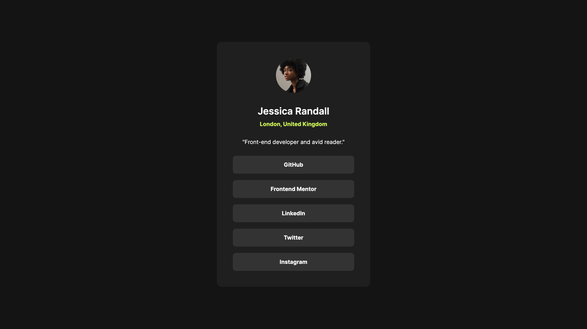

# QR Code Component

This project is a responsive social links profile page built using HTML and CSS. It showcases a modern design with a profile image, personal details, and interactive social media links.

## Screenshots



## Demo

[View Live Project](https://3-social-links-profile-sooty.vercel.app/)

## Project Structure

```
/social-links-profile
├── assets/
│   ├── fonts/
│   ├── images/
│   ├── preview/
├── index.html
├── styles.css
├── README.md
```

## Technologies Used

- HTML5
- CSS3

## Installation & Usage

To run the project locally:

1. Clone the repository:
   ```sh
   git clone https://github.com/austin-jonas/3-social-links-profile.git
   ```
2. Open index.html in a browser.